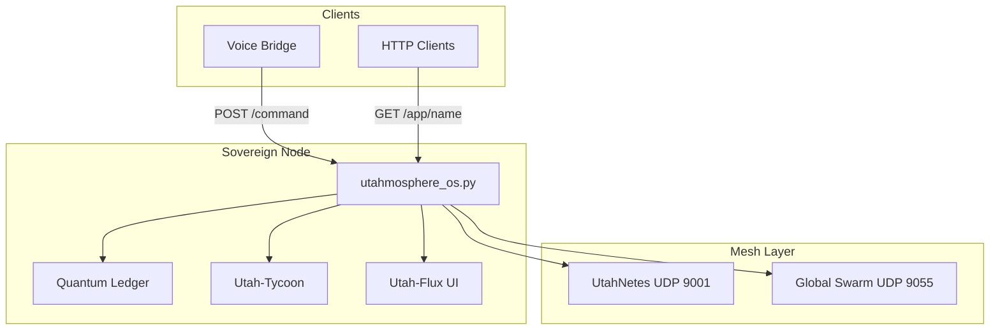

# Tutorial: Architect Deployment

**Audience:** Solution architects, platform engineers  
**Time:** 45 minutes  
**Goal:** Design a multi-node UtahMosphere topology

---

## Architecture Overview



---

## Step 1: Size Your Hardware

| Workload profile | Minimum hardware |
|------------------|------------------|
| Dev / pilot | 2 GB RAM, 2 cores, 8 GB disk |
| Small production | 4 GB RAM, 4 cores, 32 GB SSD |
| Edge + voice | Add USB microphone, stable network |

See [Technical Deep-Dive](../TECHNICAL_DEEP_DIVE.md) for subsystem details.

---

## Step 2: Network Design

| Port | Protocol | Purpose | Exposure |
|------|----------|---------|----------|
| 8999 | TCP | HTTP API | LAN or reverse proxy |
| 9001 | UDP | Multicast gossip | Same LAN segment |
| 9055 | UDP | Swarm P2P | WAN peers (firewall rules) |

**Multicast requirement:** UtahNetes gossip uses `239.255.43.21:9001`. Routers must allow multicast on the LAN.

---

## Step 3: Deploy Primary Node

```bash
export UTAH_SECRET_VECTOR="$(openssl rand -hex 32)"
export UTAH_DATA_DIR="/var/lib/utahmosphere"
sudo -E bash setup.sh
```

Verify:

```bash
curl http://127.0.0.1:8999/health
curl http://127.0.0.1:8999/status
```

---

## Step 4: Claim and Secure

1. Run `voice_bridge.py` on the primary node
2. Say **"Claim node"** — anchors biometric root
3. Document recovery procedure: [Operations Runbook](../OPERATIONS_RUNBOOK.md)

**Open mode warning:** Unclaimed nodes accept any voice hash. Claim before production exposure.

---

## Step 5: Deploy Workloads

```bash
python examples/voice-deploy-simulator/deploy.py api-v1
python examples/voice-deploy-simulator/deploy.py worker-v1
```

Inspect registry:

```bash
cat /var/lib/utahmosphere/secure_registry.json
```

Each tenant receives:

- `execution_port` (8200+)
- UtahX manifest at `utahx_mesh/{app}.utahx.json`
- Handler at `containers/{app}/handler.py`

---

## Step 6: Multi-Node Convergence

On a second LAN node:

1. Repeat setup with same multicast reachable
2. Deploy overlapping app names — gossip syncs newer `epoch` timestamps
3. Monitor `[UtahNetes]` gossip in logs

Swarm WAN linking requires claimed nodes (root vibe initializes `UtahSwarmNode`).

---

## Step 7: Ingress Strategy

Today, UtahX writes JSON route manifests. For production HTTP ingress:

- **Option A:** Place Caddy/Nginx in front of `:8999` (hybrid)
- **Option B:** Wait for UtahX TCP proxy (roadmap)
- **Option C:** Direct `:8999` on trusted LAN

---

## Design Checklist

- [ ] `UTAH_SECRET_VECTOR` unique per environment
- [ ] Node claimed before external exposure
- [ ] Backup schedule for registry + ledger
- [ ] Monitoring on `/health` and `/status`
- [ ] Firewall rules documented
- [ ] Capability matrix reviewed for API gaps

Recipes: [Architect Recipes](../recipes/architect-recipes.md)
